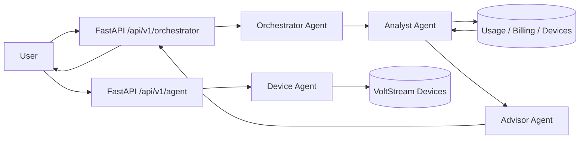
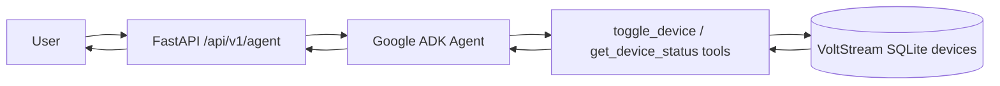

# VoltStream ADK Device-Control Agent Demo

## Orchestrator Checkpoint

POST `/api/v1/orchestrator`

```json
{
  "question": "Give me energy-saving advice based on my last week's usage"
}
```

Expected routing:

1. Orchestrator Agent receives the user question and selects `analyst_agent`.
2. Analyst Agent retrieves VoltStream usage, solar, billing, and active-device data.
3. Advisor Agent reads the Analyst output and returns practical energy-saving recommendations.

The JSON response includes `agent`, `route`, and `trace`, and the chat UI renders
that trace under the answer.

Device control stays separate. Device toggles should continue to use `/api/v1/agent`
or the Smart Control command bar.



## Checkpoint Request

POST `/api/v1/agent`

```json
{
  "message": "Turn off the Air Conditioning"
}
```

The endpoint streams NDJSON events. The final event includes the answer, updated
device status, and a trace of the agent loop.

Expected final tool action:

```json
{
  "tool": "toggle_device",
  "args": {
    "device_id": "dev_1",
    "state": "OFF"
  }
}
```

## Agent Loop

1. Plan: read the user request and identify the goal.
2. Select tool: choose `toggle_device` with the target device and desired state.
3. Execute: run the Python tool against VoltStream's device database.
4. Observe: read the updated device payload returned by the tool.
5. Respond: summarize the completed action and device status.

## Architecture



## Notes

- `/api/v1/agent` runs through Google ADK.
- Install dependencies with `pip install -r requirements.txt`.
- For Vertex AI service-account auth, set `GOOGLE_GENAI_USE_VERTEXAI`,
  `GOOGLE_CLOUD_PROJECT`, `GOOGLE_CLOUD_LOCATION`, and
  `GOOGLE_APPLICATION_CREDENTIALS` in `backend/.env`, then restart the FastAPI
  server.
- Optional: set `GEMINI_MODEL` and `ADK_MODEL` to override the default model.
